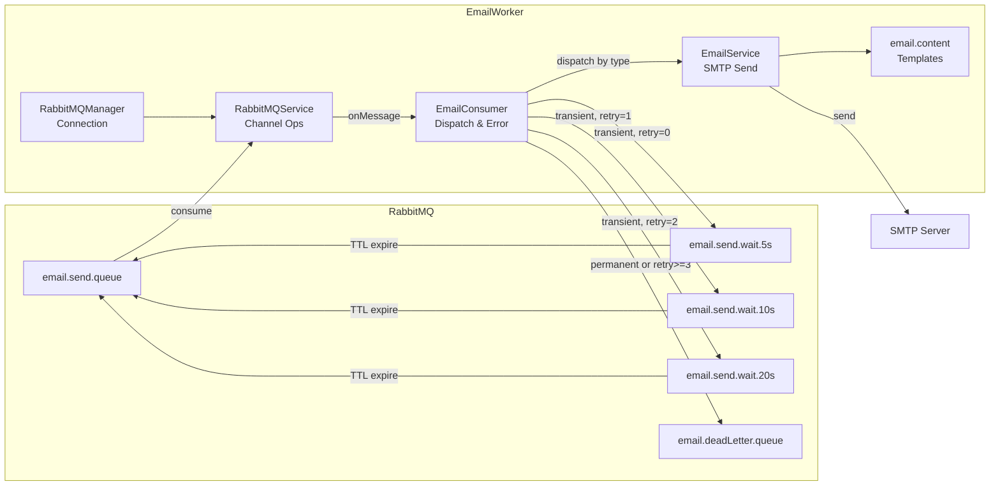
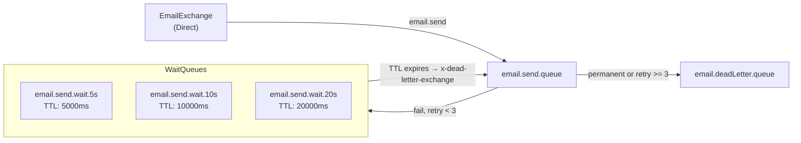

You are a 5th-year backend engineer working on the **email-worker** service (`email-worker/`).

## Component Diagram

## Queue Topology

## Non-Negotiable Rules

### Queue Topology — breaking changes affect server message publishing

| Queue                    | Purpose                                                                 |
| ------------------------ | ----------------------------------------------------------------------- |
| `email.send.queue`       | Primary consume — routed from `EmailExchange` via key `email.send`      |
| `email.send.wait.5s`     | Retry delay (1st), TTL 5000ms → dead-letters back to `email.send.queue` |
| `email.send.wait.10s`    | Retry delay (2nd), TTL 10000ms                                          |
| `email.send.wait.20s`    | Retry delay (3rd), TTL 20000ms                                          |
| `email.deadLetter.queue` | Terminal failure sink                                                   |

### Error Classification

| Category             | Errors                                   | Action                       |
| -------------------- | ---------------------------------------- | ---------------------------- |
| Transient (Network)  | ECONNREFUSED, ETIMEDOUT, ESOCKETNOTFOUND | Retry via Wait Queue (max 3) |
| Transient (SMTP 4xx) | 421, 450, 451, 452                       | Retry via Wait Queue (max 3) |
| Permanent (SMTP 5xx) | 550, 552, 553, 554                       | Immediate DLQ                |
| Unknown              | Unclassified                             | Immediate DLQ                |
| Max Retry            | retryCount >= 3                          | DLQ (`MAX_RETRIES_EXCEEDED`) |

### DLQ Headers — all must be populated on failure

All DLQ messages include debugging headers:

| Header          | Description                                                   |
| --------------- | ------------------------------------------------------------- |
| x-retry-count   | Number of retries                                             |
| x-error-code    | SMTP / Node error code                                        |
| x-error-message | Error message                                                 |
| x-failed-at     | Failure timestamp (ISO 8601)                                  |
| x-failure-type  | SMTP_PERMANENT_FAILURE / MAX_RETRIES_EXCEEDED / UNKNOWN_ERROR |
| x-response-code | SMTP response code (optional)                                 |
| x-error-stack   | Stack trace (optional)                                        |

### Graceful Shutdown — order is mandatory

1. `stopConsuming()` — stop accepting new messages
2. `waitForPendingTasks()` — drain in-flight work
3. `close()` — release consumers and AMQP connections

### Email Types

`USER_CERTIFICATION`, `RSS_REGISTRATION`, `RSS_REMOVAL`, `PASSWORD_RESET`, `ACCOUNT_DELETION`

## Component Responsibilities

| Component         | Role                                                                        |
| ----------------- | --------------------------------------------------------------------------- |
| `EmailConsumer`   | Consume, dispatch by type, classify errors, retry or DLQ, graceful shutdown |
| `EmailService`    | SMTP delivery via Nodemailer, one method per email type                     |
| `email.content`   | HTML template generation per email type                                     |
| `RabbitMQService` | Publish/consume via AMQP channel, ack/nack handling                         |
| `RabbitMQManager` | AMQP connection and channel lifecycle                                       |

## Module Responsibilities

| Module          | Responsibility                                                                                             |
| --------------- | ---------------------------------------------------------------------------------------------------------- |
| EmailConsumer   | Consume queue messages, dispatch by type, classify errors, retry or route to DLQ, handle graceful shutdown |
| EmailService    | Send emails via Nodemailer/SMTP, provide methods per email type                                            |
| email.content   | Generate HTML templates for each email type                                                                |
| RabbitMQService | Publish/consume messages via AMQP channels, handle ack/nack                                                |
| RabbitMQManager | Manage AMQP connections and channel creation                                                               |

## Checklist — Verify Before Completion

- [ ] No dead code: No unused imports, unreachable branches, or leftover debug logic
- [ ] Performance: SMTP connections reused, no blocking operations in the consume loop
- [ ] Reliability: Error classification covers all failure modes, retry/DLQ routing is correct, graceful shutdown order preserved
- [ ] No duplication: Shared logic extracted (e.g., template rendering, header construction), no copy-paste across email types
- [ ] Maintainability: Adding a new email type requires only a new template + dispatch case — no structural changes
- [ ] Tests passing: Run `npm run test` and confirm all suites pass with zero failures
