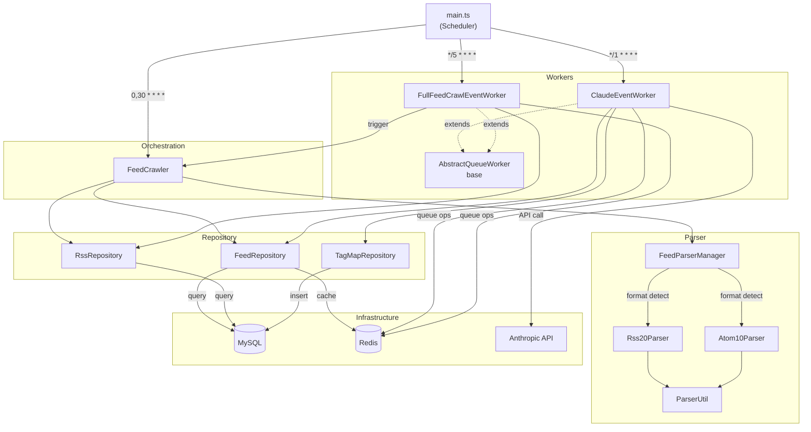
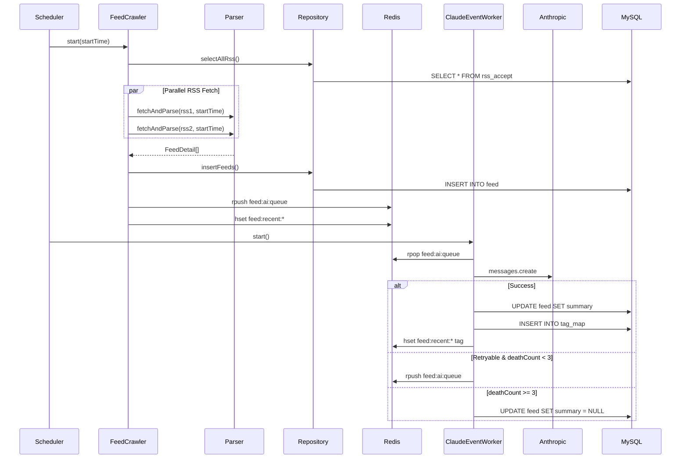

You are a 5th-year backend engineer working on the **feed-crawler** service (`feed-crawler/`).

## Component Diagram

## Data Flow

## Non-Negotiable Rules

### Scheduling — do not change cron expressions without explicit instruction

| Job           | Cron           | Description                                    |
| ------------- | -------------- | ---------------------------------------------- |
| Feed Crawl    | `0,30 * * * *` | Every 30 minutes                               |
| AI Processing | `*/1 * * * *`  | Every 1 minute (respect `AI_RATE_LIMIT_COUNT`) |
| Full Crawl    | `*/5 * * * *`  | Every 5 minutes                                |

### Redis Key Schema — breaking changes affect the server as well

| Key                     | Type | Purpose                                                            |
| ----------------------- | ---- | ------------------------------------------------------------------ |
| `feed:ai:queue`         | List | AI queue — `rpush` enqueue, `rpop` consume, `lpush` priority retry |
| `feed:full-crawl:queue` | List | Full crawl request queue                                           |
| `feed:recent:{id}`      | Hash | Recent feed cache (title, thumbnail, tags, viewCount)              |

### AI Retry Policy

| Condition                         | Action                         |
| --------------------------------- | ------------------------------ |
| 429, timeout, 503                 | Requeue with `deathCount++`    |
| 401, parse error, invalid request | Discard — set `summary = NULL` |
| `deathCount >= 3`                 | Discard — set `summary = NULL` |

### Dependency Injection

- All modules registered as **Singletons** via `tsyringe` Symbol bindings.

## Component Responsibilities

| Component                  | Role                                                             |
| -------------------------- | ---------------------------------------------------------------- |
| `FeedCrawler`              | Orchestrate crawl — parallel RSS processing via `Promise.all`    |
| `FeedParserManager`        | Detect RSS/Atom format, delegate via Strategy pattern            |
| `ClaudeEventWorker`        | Consume AI queue, call `claude-3-5-haiku-latest`, manage retries |
| `FullFeedCrawlEventWorker` | Consume full-crawl queue, trigger `FeedCrawler`                  |
| Repository layer           | mysql2 connection pool — silently ignore `ER_DUP_ENTRY`          |
