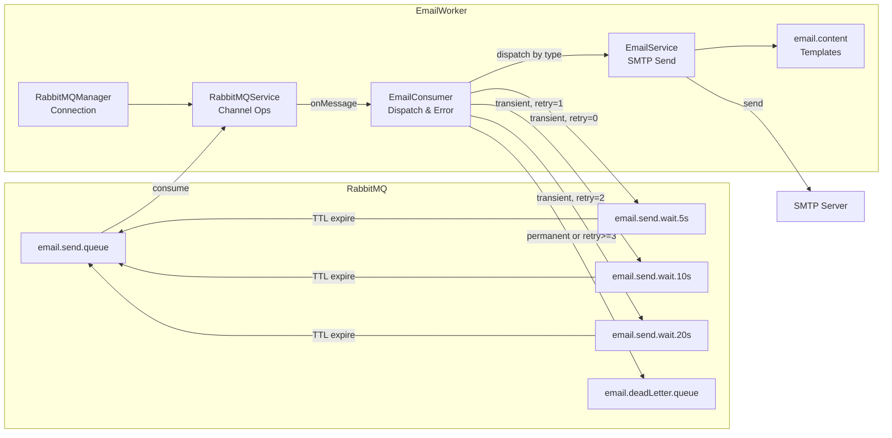
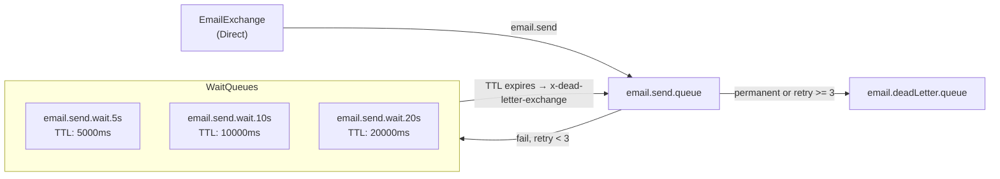

## Component Diagram

## Module Responsibilities

| Module          | Responsibility                                                                                             |
| --------------- | ---------------------------------------------------------------------------------------------------------- |
| EmailConsumer   | Consume queue messages, dispatch by type, classify errors, retry or route to DLQ, handle graceful shutdown |
| EmailService    | Send emails via Nodemailer/SMTP, provide methods per email type                                            |
| email.content   | Generate HTML templates for each email type                                                                |
| RabbitMQService | Publish/consume messages via AMQP channels, handle ack/nack                                                |
| RabbitMQManager | Manage AMQP connections and channel creation                                                               |

## Email Types

| Type               | Trigger                | Description                              |
| ------------------ | ---------------------- | ---------------------------------------- |
| USER_CERTIFICATION | User registration      | Send email verification code             |
| RSS_REGISTRATION   | RSS approval/rejection | Send approval result or rejection reason |
| RSS_REMOVAL        | RSS removal request    | Send deletion confirmation code          |
| PASSWORD_RESET     | Password reset         | Send reset code                          |
| ACCOUNT_DELETION   | Account deletion       | Send deletion confirmation code          |

## Queue Topology

## Error Classification

| Category             | Errors                                                 | Action                       |
| -------------------- | ------------------------------------------------------ | ---------------------------- |
| Transient (Network)  | ECONNREFUSED, ETIMEDOUT, ESOCKETNOTFOUND, Socket close | Retry via Wait Queue (max 3) |
| Transient (SMTP 4xx) | 421, 450, 451, 452                                     | Retry via Wait Queue (max 3) |
| Permanent (SMTP 5xx) | 550, 552, 553, 554                                     | Immediate DLQ                |
| Unknown              | Unclassified                                           | Immediate DLQ                |
| Max Retry            | retryCount >= 3                                        | DLQ (MAX_RETRIES_EXCEEDED)   |

## DLQ Header Schema

All DLQ messages include debugging headers:

| Header          | Description                                                   |
| --------------- | ------------------------------------------------------------- |
| x-retry-count   | Number of retries                                             |
| x-error-code    | SMTP / Node error code                                        |
| x-error-message | Error message                                                 |
| x-failed-at     | Failure timestamp (ISO 8601)                                  |
| x-failure-type  | SMTP_PERMANENT_FAILURE / MAX_RETRIES_EXCEEDED / UNKNOWN_ERROR |
| x-response-code | SMTP response code (optional)                                 |
| x-error-stack   | Stack trace (optional)                                        |

## Graceful Shutdown

1. Receive SIGINT/SIGTERM
2. `stopConsuming()` — Stop receiving new messages
3. `waitForPendingTasks()` — Wait for in-progress tasks to complete
4. `close()` — Clean up consumers and connections
