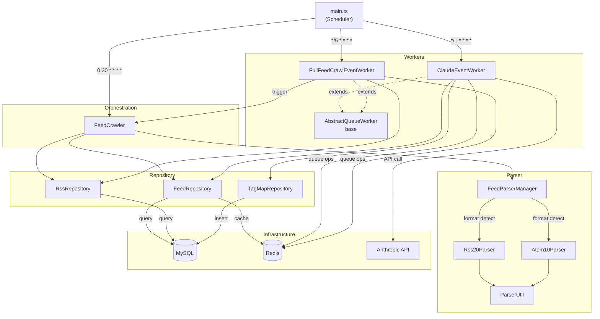
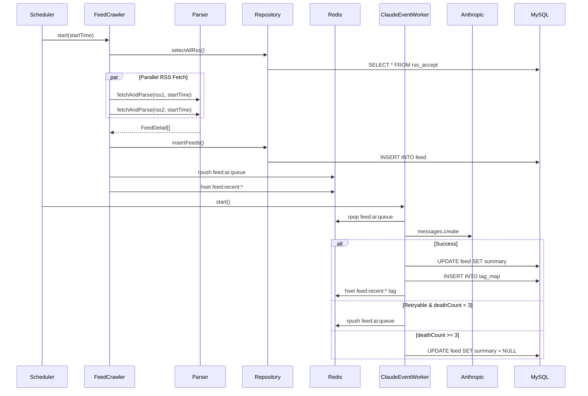

## Component Diagram

## Module Responsibilities

| Module                     | Responsibility                                                                              |
| -------------------------- | ------------------------------------------------------------------------------------------- |
| main.ts                    | Register cron schedules, handle SIGINT/SIGTERM shutdown                                     |
| FeedCrawler                | Orchestrate crawling workflow, parallel RSS processing via `Promise.all`                    |
| FeedParserManager          | Auto-detect RSS/Atom format, delegate to parser via Strategy pattern                        |
| Rss20Parser / Atom10Parser | Extract and map XML fields per format                                                       |
| ParserUtil                 | Extract thumbnails from OG meta tags, normalize HTML entities, convert URLs to absolute     |
| ClaudeEventWorker          | Consume Redis AI queue, call `claude-3-5-haiku-latest`, save summaries/tags, manage retries |
| FullFeedCrawlEventWorker   | Receive RSS IDs from Redis queue → crawl all feeds for that RSS                             |
| Repository Layer           | Execute queries via mysql2 connection pool, ignore `ER_DUP_ENTRY` duplicate keys            |

## Scheduling

| Job           | Cron           | Description                                                   |
| ------------- | -------------- | ------------------------------------------------------------- |
| Feed Crawl    | `0,30 * * * *` | Crawl new feeds every 30 minutes                              |
| AI Processing | `*/1 * * * *`  | Process AI queue every 1 minute (respect AI_RATE_LIMIT_COUNT) |
| Full Crawl    | `*/5 * * * *`  | Process full crawl queue every 5 minutes                      |

## Data Flow

## Redis Key Schema

| Key Pattern             | Type | Purpose                                                                                     |
| ----------------------- | ---- | ------------------------------------------------------------------------------------------- |
| `feed:ai:queue`         | List | AI processing queue. rpush for enqueue, rpop for consumption. Retry uses lpush for priority |
| `feed:full-crawl:queue` | List | Full crawl request queue                                                                    |
| `feed:recent:{id}`      | Hash | Recent feed cache (title, thumbnail, tags, viewCount)                                       |

## Retry Policy

| Condition                              | Action                       |
| -------------------------------------- | ---------------------------- |
| Rate limit (429), timeout, 503         | Requeue with `deathCount++`  |
| 401, invalid request, JSON parse error | Discard — set summary = NULL |
| `deathCount >= 3`                      | Discard — set summary = NULL |

## Dependency Injection

- Based on `tsyringe`.
- All Infrastructure, Repository, Service, and Worker modules are registered as **Singletons** using Symbol bindings.
